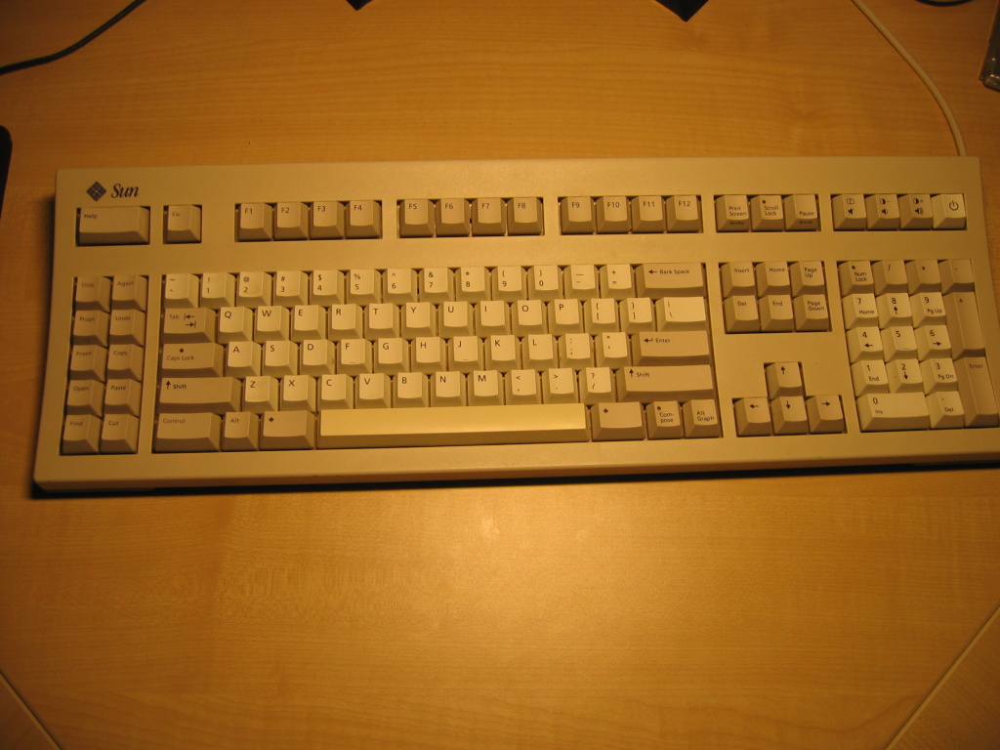
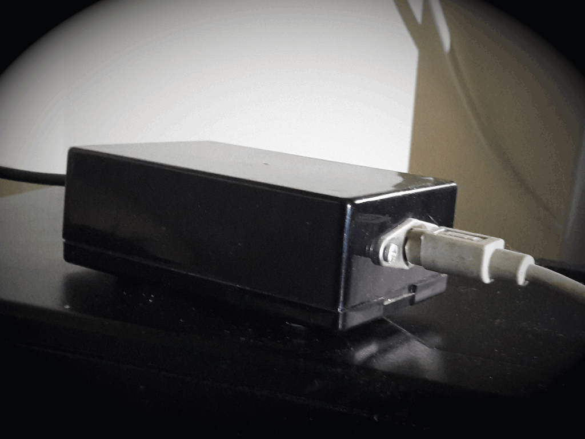
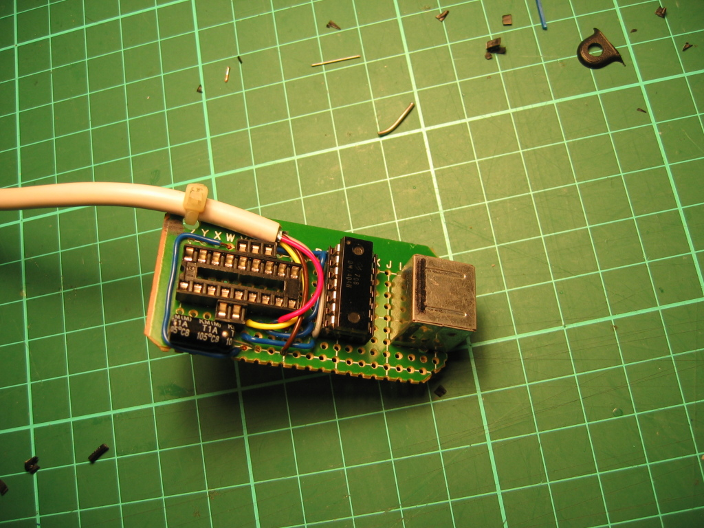
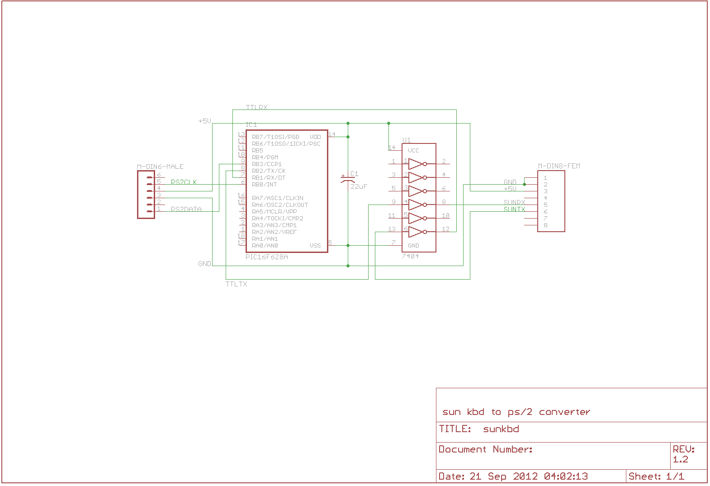
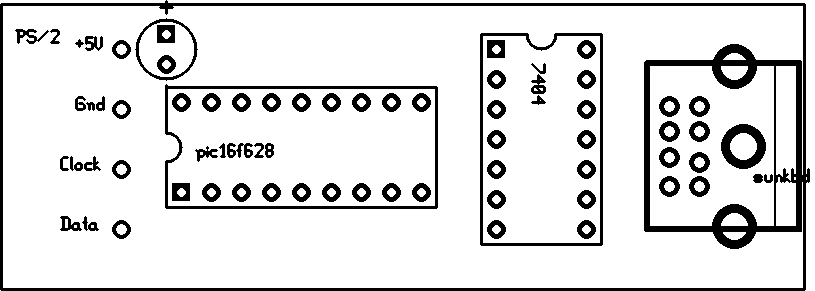
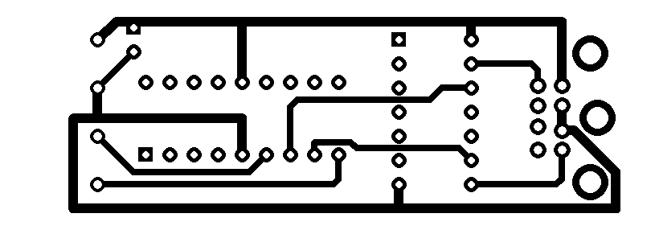
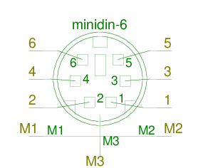
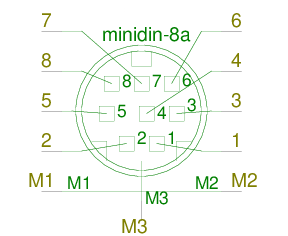

# Sun Type 5 to PS/2 : PIC-based converter

An archive of the project by [Alexander Zangerl](https://snafu.priv.at/mystuff/sunkbd.html).

Ever since I stopped using a Sun SparcStation as desktop _(around 94 or so)_ I wanted a decent Type 4 or 5 on my pc - alas, the Type 4/5 are serial keyboards and hence not directly supported by normal PC's.

&nbsp;

## Sun Type 5c goodness
Getting the Type 5 to work under Linux wouldn't have been too hard _(it's serial after all)_, but that isn't good enough: I wanted a decent solution that also work for BIOS interaction and in Windows _(and even the Linux-only solution would have required soldering up a TTL inverter)_. So why not build a converter?

Being lazy until recently I compromised _(sort-of)_ by using an [IBM Model M](http://en.wikipedia.org/wiki/Model_M): my Model M was made in 84, weighs a ton and a half, and works beautifully...but it's very very noisy _(a consequence of the buckling spring mechanism)_ and that finally got on my nerves. About eight or nine years ago I saw this Sun to PS/2 [converter project](http://www.buzzard.me.uk/jonathan/sunkbd.html), which unfortunately is rather complex to build and uses very obsolete hardware to pull it off...too much of a hassle. And the few commercial converters that I could find were ridiculously expensive. So finally I built my own converter which needs only two active and one passive component: one PIC16F628a microprocessor to do the heavy lifting, one 7404 TTL inverter and one capacitor. Together with a bit of prototyping board, a PS/2 cable with plug and a female minidin-8 socket I estimate the total cost to be no higher than AUD15. Mine actually cost less: I bought some 16F628s in bulk some time ago, the 7404 was an ancient left-over _(markings indicate it was made in the 80s...)_, the PS/2 cable and plug came from a dead donor keyboard and the minidin-8 socket I recycled out of a dead Sun. And what about the software? That's my contribution. _(Open Source, of course.)_

More recently, after having decided to build my own PS/2-based converter I found out that [Marijn Kentie](http://kentie.net/article/sunkbd/) has created a PIC-based one that does Sun-Type-4/5-to-USB, with a PIC18F. Silly hat on. But his is written in C and therefore less cool than my handcrafted PIC assembler code. Silly hat off

### Preliminaries: Sun
The Type 4 and 5 Sun keyboards are very simple beasts explained nicely in the [SPARC Keyboard Specs](datasheet/KBD.pdf): they communicate with the host using RS-232 at 1200 bps, 8N1 - but with inverted TTL logic levels _(0V = 1, 5V = 0)_. +5V power is provided together with the signal. All keys have a one-byte code that is sent on "make" _(key pressed)_ and code+0x80 is sent on "break" _(key release)_. No typematic repeat, that is handled by the host. The keyboard has a few more keys than normal pc keyboards, and one more LED, on the compose key. The keyboard also has only a few trivially simple commands _(reset, led setting, beeper on/off and click on/off)_. The pinout of the minidin-8 connector is straightforward. And that's all there is to it. Neat, simple, efficient. Dealing with this stuff on a PIC is easy, especially when you use one with USART built-in, like the 16F628 - the only necessary extra is a 7404 inverter to translate the signal levels.

### Preliminaries: PS/2
The electrical PS/2 protocol is ugly, to put it politely. The PS/2 keyboard protocol is fucking horrible, and that's still putting it politely! The electrical part is described very well by [Adam Chapweske](datasheet/PS2_Keyboard.pdf). It's a two-wire bidirectional protocol, with a "master" _(the host)_ that isn't mastering anything but the art of interrupting progress at any time it feels like it: the only thing the master ever does is tell the slave to stop whatever it's doing or to start clocking. With PS/2 it's the slave that outputs the clock pulses. Device-to-host transmissions work different from host-to-device, adding to the fun for an implementor. At least all transmissions are done in bytes. Some of the borderline cases I didn't find any precise information on _(e.g. the timing sequence of the host-to-device clocking request; the best I could find is 'host pulls clock low, then pulls data low, then releases clock')_, but there seems to be a lot of leeway in the spec _(e.g. pulse length can be anything between 25us and 50us)_. And the electrical part is easy, compared to the backwards-compatible mess that the PS/2 keyboard protocol is: most of the crappy stuff dates back to 84-key PC/XT keyboards and contains lots of really lousy design decisions made by IBM.

    IBM: It may be slow, but it's hard to use. -- Simon Cozens

The best explanation/material collection for the scan codes I found to be the one collected by [John Savard](datasheet/ScanCodesDemystified.pdf). In as few words as possible: keys send make and break codes _("scan codes" in PS/2 parlance)_, just like the Sun does - but the codes follow no useful scheme whatsoever and differ in size: anywhere from 1 to 8 bytes. One key sends no break code at all, and in theory there's three different set of codes for any single key _(fortunately only Set 2 is required nowadays)_. And to make all this even more fun, the typematic repeat must be handled by the device, there's multiple repeat/delay rates as well, and there's a bunch of generally superfluous commands that a keyboard should understand as well. Lots of joy! My students got a really good laugh out of it when I told them last week that I write code in assembler for fun _(and indeed, the PS/2 part of this project was "lots" of fun, for masochistic values of lots)_.

## My Converter
The PIC deals with the Sun using its built-in USART, with the 7404 inverter sitting inbetween. The PS/2 side is done "manually", bit-banging two ports of the PIC whose internal pullup resistors are enabled. The mechanical layout of my converter is trivial: a small piece of prototyping board holds two sockets for the PIC and the 7404, and one 22uF electrolytic capacitor sits near the PIC. One end of the board holds a female minidin-8 socket for the Sun keyboard plug, and the PS/2 cable was soldered in at the other end. Power comes from the PS/2 connector, and powers everything: the PIC, the 7404 and the Sun keyboard. Here is my prototype _(with extra in-circuit programming sockets)_:

&nbsp;

The electrical setup is about as trivial, and shown on this schema.

I've even cooked up a small PCB design _(untested, though)_. These PNGs are 300dpi and if you use this for a toner transfer you'll have to mirror the silk side but not the solder side.

&nbsp;

The pinouts for the female sockets, looking at the socket face:

&nbsp;

The design also successfully works behind a _PS/2 to USB_ converter.
 
### Limitations
- My converter presents a somewhat dumb keyboard to the host: any and all PS/2 commands are acknowledged _(in best "yes, minister!" tradition)_ - and most are then completely ignored. Implemented are: Reset, Get ID and Set LEDs. The keyboard also doesn't request resends from the host, nor does it act upon the hosts' resend requests - I haven't seen any need for those in practice.

Apparently all modern keyboard controllers _(8042-clones embedded in the SuperIO chips)_ don't care about the extra commands and don't even pass them on to the keyboards.

- The repeat rate is fixed at 250ms initial delay, then 30 keys per second.

- The Compose LED on the Sun keyboard isn't known to PS/2, and the converter arbitarily associates it with bit 3 of the Set LEDs argument _(bits 0 to 2 are num, caps and scroll lock)_. If you can convince your OS/hardware to pass the extra bit then your compose LED will be controllable; otherwise it'll stay off.

- The keyboard's buzzer or the key click functions are not accessible via PS/2, so those are off.

- The handling of the Print Screen key is simplified: while the standards say that it should be wrapped in the scancodes for shift _(plus an extra annoyance byte)_, the converter doesn't do that. Neither does it create the sysreq scan code with alt held down.

I have found that all OS's I tried _(linux and win)_ work fine with that - it looks like the keyboard controller fixes up the scancode as required.

- Similarly, the numlock handling is simplified: According to this [MS keyboard scan code specification](datasheet/ms-scancode.pdf), a keyboard should remember all modifiers held down while numlock is in use and modify the scancodes sent accordingly. This is a ridiculously crappy setup _(what do we have the damn make/break codes for, except for the host to figure out which keys are currently down?)_ and it's also not necessary in practice.

- The extra keys on the Sun keyboard were mapped to the nearest equivalents I could find in various sources.

The power key is mapped to ACPI Power, the brightness/volume and mute keys are mapped to the Windows Multimedia Keyboard scancodes and so is the Stop key.

The left and right Meta keys _(Diamond on the Sun keyboard)_ are mapped to Left and Right Window key, respectively. The Compose key is mapped to the Windows Menu key.

For the non-obvious ones _(Help, Undo/Again, Copy/Paste/Cut, Props, Front, Open, Find)_ I used scan codes from Savard's list.

On Unix systems the mapping of these is trivial _(Linux: setkeycodes for a few, then Xmodmap to make them available under X)_. on Windows systems you'll have to use a remapper tool or frob the registry by hand. I've tried [SharpKeys](http://www.randyrants.com/2006/04/sharpkeys_21.html) which works fine for the remapping, and [Hoekeys](http://www.bcheck.net/apps/hoe.htm) for attaching actions to keys.

## Code! Code! Code!
The code is as simple and robust as I could make it, and pretty well documented - I think. The keycode to scancode translation is done with two tables, one 128 byte one _(for the one-byte scancodes)_ and one 27 byte one _(for the two byte scancodes)_. The Pause key is handled separately. As the 16F628 has only 128 byte of EEPROM the two tables are done using the trusty old computed-goto method. Sun input is handled via an interrupt handler which pushes key codes into a small _(8 byte)_ inbound fifo. The main loop monitors the PS/2 bus for activity _(remember, the PIC has to clock for the host on request)_ and otherwise processes key codes from the input fifo: it translates them into scan codes and pushes those into an output fifo _(16 bytes deep)_. The main loop also empties that fifo by sending out pending scancodes whenever the PS/2 bus allows it, and furthermore deals with the few PS/2 commands that are implemented. Sending to the Sun keyboard is done via the USART, and due to the PIC hardware that's a fire-and-forget operation _(for up to two sequential bytes)_. Another part of the interrupt handler deals with timeouts: a timer is armed whenever a make code is processed _(and disarmed on break)_ and when the timer expires the interrupt handler inserts another copy of the held-down key code into the inbound fifo and rearms the timer _(initial 250ms, then 33ms)_. And that's about it.

For those of you who like to tinker with the source: go for it! It is, as usual, [GPL-licensed](http://en.wikipedia.org/wiki/GPL) and as such freely available for your use. Here is the list of files:

- The main program code: [sunkbd.asm](code/sunkbd.asm)
- The fifo helper routines: [fifo.inc](code/fifo.inc)  
- Some delay helper routines: [delay.inc](code/delay.inc)  
- For convenience here's the compiled code, ready for your PIC: [sunkbd.hex](code/sunkbd.hex)
- Datasheet for the [PIC16F62x](datasheet/PIC16F62x.pdf)

&copy; [Alexander Zangerl](https://snafu.priv.at/about/me/99contact.html)
